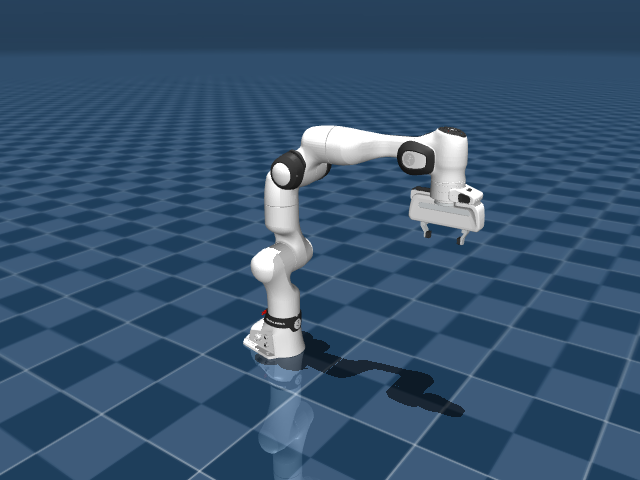

# Complete Franka Research 3 with parallel gripper

`fr3.xml` is the full robot: base, seven arm links, wrist-mounted Franka Hand,
and two sliding fingers. All robot definitions are in this XML, and all arm
and gripper meshes are in `assets/`. This folder works independently.

Load `scene.xml` to include the robot, ground plane, and viewing setup.
The initial model is already in the collision-free home pose with the fingers
open. The `home` keyframe also initializes the actuator controls to hold that pose.

- Seven revolute arm joints: `fr3_joint1` through `fr3_joint7`.
- Two prismatic finger joints: `fr3_finger_joint1` and `fr3_finger_joint2`.
- Finger travel: 0–40 mm each, coupled for an opening of up to 80 mm.
- Gripper actuator: `fr3_actuator8`; control 0 closes it, 255 opens it.

Both fingers explicitly use `type="slide"`; their joint positions are in meters,
not radians. The reference body poses and joint `ref` values encode home while
preserving the original absolute joint coordinates. A joint's displacement from
its reference geometry is `q - ref`. The rotated right-finger frame reverses
its physical slide direction, so equal finger coordinates open them symmetrically.

## Sources and modifications

Adapted from MuJoCo Menagerie commit
`4d038b3feae26ec82b46a4d586379114012a8ac7`:

- [FR3 arm](https://github.com/google-deepmind/mujoco_menagerie/tree/4d038b3feae26ec82b46a4d586379114012a8ac7/franka_fr3), under [LICENSE](LICENSE).
- [Franka Hand](https://github.com/google-deepmind/mujoco_menagerie/blob/4d038b3feae26ec82b46a4d586379114012a8ac7/franka_emika_panda/hand.xml), under [LICENSE.franka_hand](LICENSE.franka_hand).

The hand bodies, defaults, assets, collision exclusions, tendon, equality
constraint, and actuator are embedded directly in the FR3 model. Hand names
use the `fr3_` prefix. Its wrist mounting transform is 107 mm along wrist Z and
-45 degrees about Z. Reference geometry is posed
at home with corresponding joint reference values; meshes and joint limits are
unchanged. The home keyframe includes the fingers' open positions and gripper
control. `fr3.png` is a native MuJoCo render of the bundled model's initial pose.
Both sources are licensed under Apache-2.0. `CHANGELOG.md` is the upstream
arm changelog.
